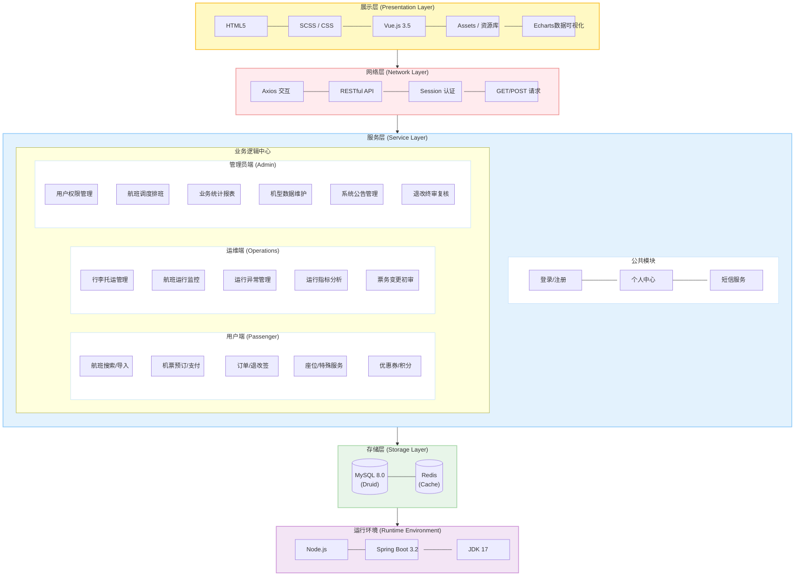

# 飞机售票系统技术架构图

根据现有代码库（Vue 3 + Spring Boot 3 + MySQL）及您提供的模板，生成的技术架构图如下：

## 架构说明

### 1. 展示层 (Presentation Layer)
- **Vue.js 3.5**: 核心前端框架，负责响应式页面渲染。
- **Echarts**: 用于管理员端和运维端的统计报表展示。
- **CSS**: 采用原声 CSS 结合现代布局技术实现精美 UI。

### 2. 网络层 (Network Layer)
- **Fetch/Axios**: 前端通过 `api.ts` 封装的请求库与后端通信。
- **认证机制**: 采用基于 Session 的认证，用户信息存储在本地 `sessionStorage` 中。

### 3. 服务层 (Service Layer)
- **用户端**: 核心功能包括航班搜索、座位预订、订单支付、天气查询等。
- **运维端**: 专注于即时运行数据的监控和行李管理。
- **管理员端**: 负责系统基础数据维护（机型、航班）及业务统计。

### 4. 存储层 (Storage Layer)
- **MySQL**: 存储用户信息、航班排班、订单记录等核心数据。
- **Druid**: 高性能数据库连接池，提供监控和扩展能力。

### 5. 运行环境 (Runtime Environment)
- **Spring Boot 3.2**: 提供 RESTful 接口服务。
- **Node.js**: 用于前端项目的构建与开发调试。
